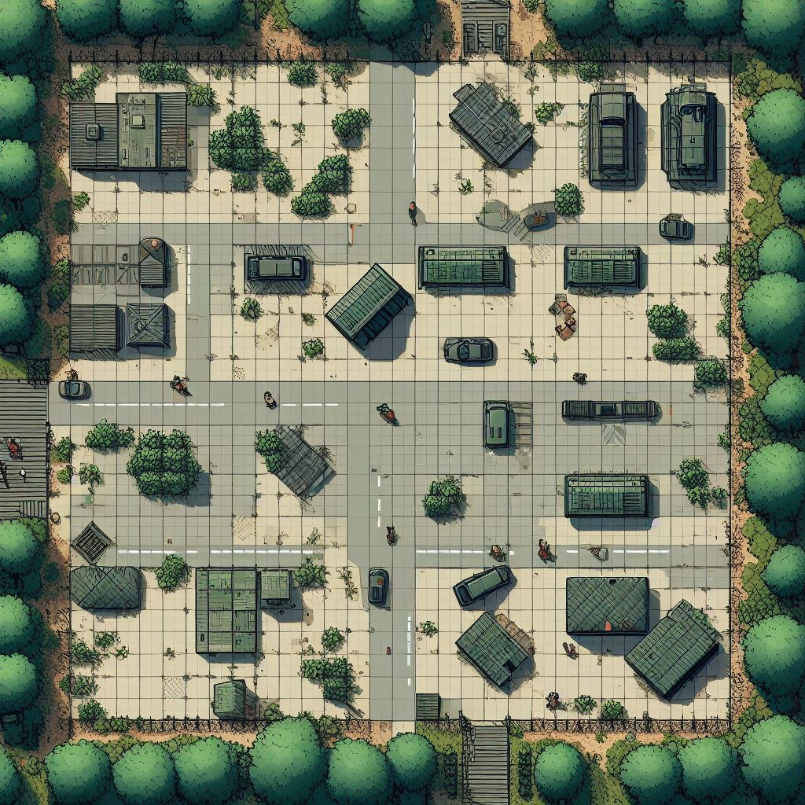
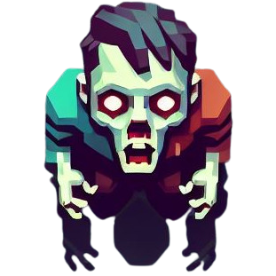

# Survival Waves
Survival Waves est un jeu ou plusieurs joueurs doivent survivre à plusieurs vagues de zombies consécutives. 

## 🎯 Contexte & cahier des charges
Dans le cadre de la ressource R5.05 Programmation avancée.

## 🎲 Règles du jeu

## Maquette

### Map

### Zombie

## 🎮 Use cases
- pour l'administrateur
Expliquer ce que peut/doit faire un administrateur qui souhaite lancer/administrer une arène de jeu avec des apprenants 

- pour le joueur
Renvoyer vers README API

* **En tant que Joueur** :
    * Je peux me déplacer d'une case par tick
    * Je peux attaquer les zombies à l'aide d'une arme à feu
    * Tuer un zombie redonne instantanément des munitions
    * Je peux récupérer une arme par terre pour améliorer mes stats de dégâts
    * Je peux ramasser des trousses de soins par terre et me soigne
    * Je peux voir toutes les unités joueur/objets/non-joeurs de la carte
    * Je peux améliorer mes statistiques de vie/dégâts au fur et à mesure du nombre de zombies que je tue
* **En tant que zombie** :
    * Je peux me déplacer aléatoirement
    * Je peux détecter un humain dans un rayon X pour lui foncer dessus
    * Je peux détecter un humain à n'importe quelle distance s'il me tire dessus
    * Je peux attaquer et transformer un humain en X coups
    * Je ne peux pas ramasser d'armes
* **En tant qu'Arbitre** :
    * Je peux lancer une nouvelle vague
    * Je peux faire apparaître des objets au début d'une vague
    * Je peux faire réapparaître tous les joueurs à chaque nouvelle manche
    * Je peux afficher les changements de manche
    * Je peux faire apparaître des zombies
    * Je peux augmenter le nombre de zombies à chaque vague et/ou améliorer leurs stats
    * A la fin d'une manche, je peux modifier le score de la manche dans le scoreboard
    * Si tous les survivants sont mort, je mets fin à la vague en cours et note le nombre de manches passé dans le scoreboard

### Déroulé d'une partie
Un certain nombre de joueurs apparaissent sur la carte. 

Lorsque la partie commence, plusieurs zombies apparaissent en essayant de dévorer les joueurs. Si un joueur est touché plusieurs fois par un zombie,  il se transforme lui-même en zombie.

À la fin de la vague si au moins un joueur a survécu, tous les autres joueurs réapparaissent.

### Conditions de victoires
Le joueur doit survivre au maximum de vague possible.

## 🖧 Architecture matériel 
(optionnel, peut être décrit avec le diagramme de séquence) 
Schéma overview présentant les machines et protocoles (serveurs, clients, broker) avec texte expliquant le choix des technologies 

## 📞 Diagramme de séquence
Expliquer les points suivants
- [ ] les acteurs
- [ ] le déroulé d'une partie en partant des use case
- [ ] les données échangées entre chaque couche
- [ ] les algorithmes
- [ ] les machines
- [ ] les protocoles réseaux

## ✅ Pré-requis 
- pour l'administrateur
Matériel et logiciel requis pour executer votre projet
- pour les apprenants 
Rediriger vers README API

## ⚙️ Installation
Step by step : commandes à executer par l'administrateur, paquets à installer ...

## 🧪 Tests
- définition du plan de test ce qu'on attend quand on fait quoi 
- step by step pour lancer les tests

## 🛣️ Roadmap
Ce qui reste à faire priorisé dans le temps

## 🧑‍💻 Auteur(s)
* ANGOT Alexandre
* CAILLY Clément
* DESMONST Arthur
* TOLLEMER Hélie

### Sources 
- DALLE 3: pour la création de chaque illustration.

## ⚖️ License
S'appuyer sur https://choosealicense.com/ ou la doc de github
Attention à vérifier la compatibilité de votre licence avec celles des modules utilisés

# 💯 Evaluation de votre jeu
Soutenance orale de 10 Ã  15 minutes en groupe suivie de 5 Ã  10 minutes de questions

Vous serez évalués par votre enseignant ainsi que vos camarades via un formulaire en ligne, selon les critères suivants :
- [ ] Respect des bonnes pratiques de développement : SOLID, CDD, TDD, POO, Designs Patterns, DRY
- [ ] Originalité de votre proposition, du gameplay, de vos graphiques
- [ ] Facilité de prise en main de l'API pour les utilisateurs en Python pour créer leur agent et mettre en oeuvre les user stories prévues
- [ ] Facilité de prise en main du viewer de l'arène par les utilisateurs en reliant les boutons "tutoriel" à votre readme github, et le bouton "code your own robot"
- [ ] Documentation : respect du plan demandé pour les README, les diagrammes de conception sont fournis (séquence, classe)
- [ ] Docstrings pour chaque classes, fonctions, fichier
- [ ] Présentation : respect du temps, utilisation d'un langage technique adapté

Votre présentation devra suivre le plan suivant:
- Introduction : cahier de charges, contexte, organisation du groupe
- Etat initial du projet, Conception schémas et modèles, solutions développées, état final et démonstration
- Conclusion : rétrospective, ce qui marche/ce qui ne marche pas, évolutions possibles

Les séances du mardi 16/01 et mercredi 17/01 seront consacrées au passage des soutenances. Pensez-donc bien à finaliser tous vos livrables avant pour pouvoir présenter un projet fonctionnel. Tous les élèves 

Bon courage à tous !

    
